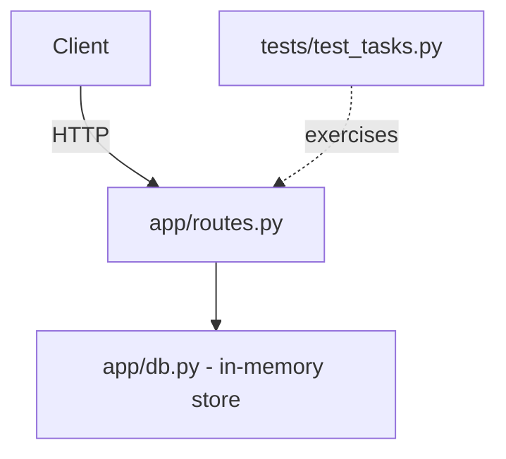

# Onboarding Brief — Tasks API

_Generated by onboarding-agent. Reuses compliance-agent's setup checklist and
diff-analyst's file-churn risk scan instead of recomputing them — this reuse
is the core "shared repo-intelligence engine" idea behind RepoPilot._

## 1. Architecture map

Tasks API — a small Flask service for creating and tracking tasks.

## 2. Where things live

| If you need to... | Look in |
|---|---|
| Add or change an endpoint | `app/routes.py` |
| Change how tasks are stored | `app/db.py` |
| Add a test | `tests/test_tasks.py` |
| Document a new env var | `.env.example` and `README.md` |
| Record a behavior change | `CHANGELOG.md` |

## 3. Domain glossary

- **Task** — a unit of work with a title and a completion flag.
- **TASKS_MAX_LIMIT** — env var capping how many tasks `GET /tasks` returns.
- **Response contract** — the fixed JSON shape returned for a task, defined
  once in `_serialize()`.

## 4. Day 0 setup checklist

- [ ] env vars documented — FAIL
- [x] setup documented — PASS
- [x] test command documented — PASS

## 5. Safest first tasks (lowest historical churn = lowest risk)

1. `sample-project/run.py` — churn score 1 (fewer historical changes = safer to learn on)
2. `sample-project/app/__init__.py` — churn score 1 (fewer historical changes = safer to learn on)
3. `sample-project/app/db.py` — churn score 1 (fewer historical changes = safer to learn on)

## 6. Self-check quiz

1. Which file defines the public JSON shape returned for a task?
   a) app/db.py  b) app/routes.py  c) tests/test_tasks.py
   **Answer: b** — `_serialize()` in routes.py is the single source of truth for the response contract.

2. Where would you add a new environment variable?
   a) Just read it with os.environ  b) .env.example and README.md  c) CHANGELOG.md only
   **Answer: b** — undocumented env vars are exactly what compliance-agent flags as a release blocker.

3. What does db.reset() do and when is it called?
   a) Clears all tasks; called in test setUp()  b) Resets the Flask app  c) Nothing, it's unused
   **Answer: a** — keeps each test isolated from previous test state.

4. If you rename a field in a task's JSON response, what should you also do?
   a) Nothing  b) Bump version + update CHANGELOG.md + consider an alias  c) Just tell your team verbally
   **Answer: b** — this is the #1 breaking-change pattern diff-analyst watches for.

5. Which file would you touch to change how tasks are stored?
   a) app/routes.py  b) app/db.py  c) run.py
   **Answer: b**

